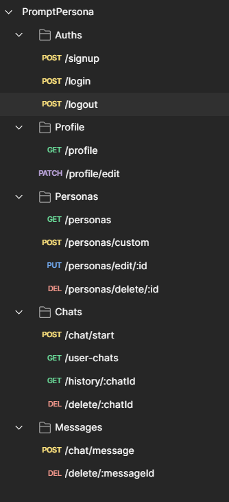

🧠 Prompt Persona — Backend
This is the Express + MongoDB backend powering Prompt Persona — an AI chatbot platform with customizable personas.

🚀 Features
User Authentication

Signup/Login with JWT (stored in HttpOnly cookies)

Secure password hashing (bcrypt)

Session auto-login & logout support

Profile Management

Edit name, age, gender

Gender used to show avatars on frontend

AI Integration

/ai/generate route using Google Gemini API

Persona-specific prompt injected with user messages

Persona System

Fetch default + user-created personas

Create, edit, and delete custom personas (auth required)

🛠️ Tech Stack
Node.js + Express

MongoDB + Mongoose

JWT, bcrypt, cookie-parser, CORS

📂 Folder Highlights
bash
Copy
Edit
/routes      → Auth, Profile, AI, Personas
/models      → User & Persona schemas
/middlewares → Auth checks (required & optional)
⚙️ .env Example
env
Copy
Edit
PORT=5000
MONGO_URI=yourMongoDB_URI
JWT_SECRET=yourSecret
GEMINI_API_KEY=yourGeminiKey
🧪 Running Locally
bash
Copy
Edit
npm install
npm run dev

# Personal Notes
    Initialized node , express , mongoose
    Initialized Git

    Connected with MongoDB

    Made User Schema
    
    Added bcrypt for hashing 
        bcrypt.genSalt(rounds) - A salt is random data added to a password before hashing, so that two users with the same password don’t have the same hash
        const hashedPassword = await bcrypt.hash(password, 10); // 10 here is the salt

    Made /signup route
    
    Made User Authentication middleware

    Made /login

    Made /profile
    Made /profile/edit 
        Added multer for profile pictures - a middleware that handles multipart/form-data — that’s how browsers send files (like images) when you upload them.

    Added Cookies

    Made Persona Model
    Made persona routes 

    Made Chat Model
    Made Message Model
    Made /chat api
    Made /messages api to send messages to persona
    Made /history to see the chats history
    Made /user-chats to see all the chats till now with different personas
    Made /delete/:chatId

    Made an optionAuth for those who do not want to sign-up or log-in

